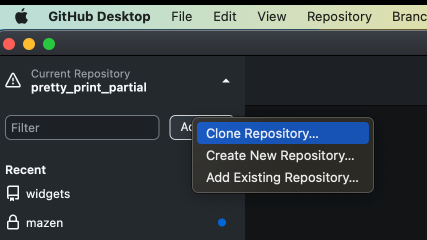
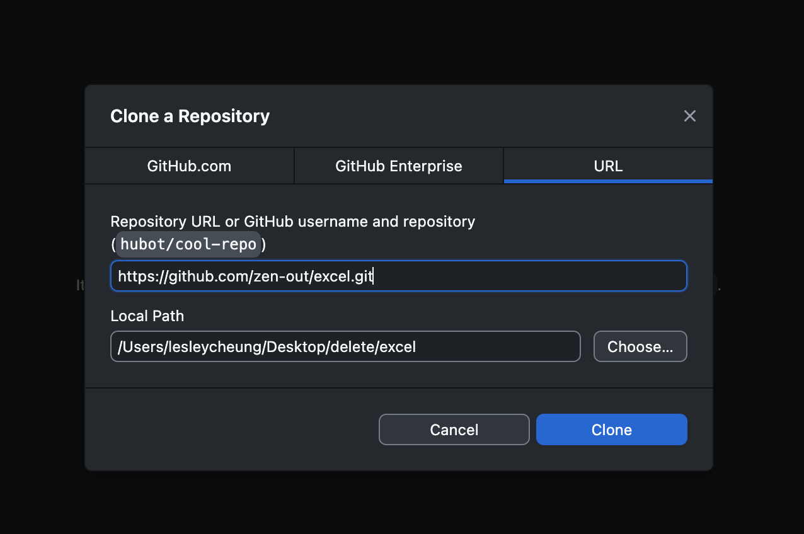

# Excel Conversion

## Prerequisites
- [Install github desktop](https://desktop.github.com/)
- [Install node.js](https://nodejs.org/en) 

## Install 
- Go to github desktop and clone repository 


- Go to your terminal / command prompt and cd into the folder
(cd means change directory)

e.g., 
```cd desktop```
```cd excel```

To go outside of a directory, type in 
```cd.. ```
Make sure you are in the directory excel

- Create a data folder (in the same level as this file)

- Put in your files 

- Go to variables.js and change the variables

- Go back to your terminal, make sure you are in the current directory 
(it should list it as excel)

- type in 
```npm install```
```node index```

- Your files should be in the data folder 


